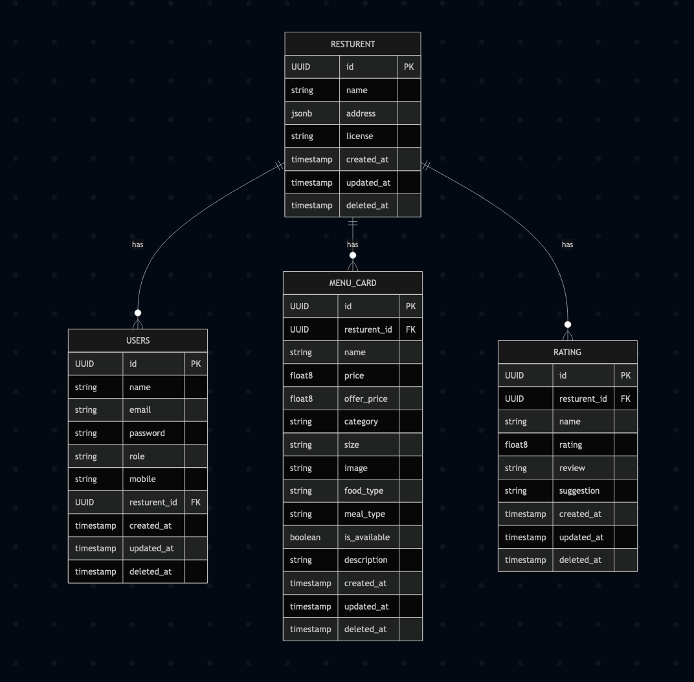

# 🍽️ MyResturent

[](https://golang.org)
[](https://github.com/rizwank123/myResturent/actions)
[](LICENSE)

---

## Overview

**MyResturent** is a modern, scalable RESTful API for restaurant management, built with Go and Echo. It supports menu management, user authentication, restaurant ratings, and more. The project is designed for extensibility, security, and ease of use, making it ideal for both production and learning purposes.

---

## ✨ Features
- 🧑‍🍳 **Restaurant & Menu Management**
- 🥗 **Menu Card CRUD & Filtering**
- ⭐ **Ratings & Reviews**
- 👤 **User Registration, Login, Roles**
- 🔒 **JWT Authentication**
- 📊 **Prometheus Metrics**
- 🩺 **Health Checks**
- 🗂️ **Swagger API Docs**
- 🛠️ **Database Migrations**

---

## 🚀 Tech Stack
- **Go** 1.23+
- **Echo** Web Framework
- **PostgreSQL** (with Goose migrations)
- **Swagger** for API documentation
- **Prometheus** for metrics
- **JWT** for authentication

---

## 🏗️ Project Structure
```
MyResturent/
  cmd/                # Application entrypoint
  internal/
    domain/           # Core business models
    http/             # Controllers, API, Swagger
    repository/       # Data access layer
    service/          # Business logic
    pkg/              # Config, security
    database/         # Migrations
  scripts/            # Helper scripts
  tests/              # Integration tests
  Makefile            # Common tasks
  sample.env          # Example environment config
```

---

## ⚡ Quick Start

### 1. Clone & Setup
```bash
git clone https://github.com/rizwank123/myResturent.git
cd myResturent
make setup # Copies sample.env to .env
```

### 2. Configure Environment
Edit `.env` with your DB credentials and secrets:
```env
APP_NAME=myResturent
APP_ENV=development
APP_PORT=7700
DB_HOST=localhost
DB_PORT=5432
DB_USERNAME=home
DB_PASSWORD=home
DB_DATABASE_NAME=myResturent
SWAGGER_HOST_URL=local.api.resturnt.co
SWAGGER_HOST_SCHEME=https
SWAGGER_USERNAME=rizwan
SWAGGER_PASSWORD=rizwan
AUTH_SECRET=secret
AUTH_EXPIRY_PERIOD=20
```

### 3. Run Database Migrations
```bash
make migrate
```

### 4. Start the Server
```bash
go run cmd/main.go
```

Server runs on `http://localhost:7700` by default.

---

## 📚 API Documentation

- **Swagger UI:** [http://localhost:7700/swagger/index.html](http://localhost:7700/swagger/index.html)
- **Login:** `/login` (use Swagger credentials from `.env`)

---

## 🗃️ Database Schema (Core Tables)

- **resturent**: id, name, address, license, timestamps
- **users**: id, name, email, password, role, mobile, resturent_id, timestamps
- **menu_card**: id, resturent_id, name, price, offer_price, category, size, image, food_type, meal_type, is_available, description, timestamps
- **rating**: id, resturent_id, name, rating, review, suggestion, timestamps

See [`internal/database/migrations/`](internal/database/migrations/) for full schema.

---

## 🗺️ Database Diagram



---

## 🧩 Main Domain Models

### Restaurant

### User

### MenuCard

### Rating

---

## 🔗 Key API Endpoints

| Method | Path                  | Description                |
|--------|-----------------------|----------------------------|
| GET    | /health               | Health check               |
| GET    | /metrics              | Prometheus metrics         |
| POST   | /user                 | Register user              |
| POST   | /user/login           | User login                 |
| GET    | /user/{id}            | Get user by ID             |
| POST   | /user/filter          | Filter users               |
| PUT    | /user/{id}            | Update user                |
| POST   | /resturent            | Create restaurant          |
| GET    | /resturent/{id}       | Get restaurant by ID       |
| PUT    | /resturent/{id}       | Update restaurant          |
| POST   | /resturent/filter     | Filter restaurants         |
| DELETE | /resturent/{id}       | Delete restaurant          |
| POST   | /menu_card            | Create menu card           |
| GET    | /menu_card/{id}       | Get menu card by ID        |
| PATCH  | /menu_card/{id}       | Update menu card           |
| DELETE | /menu_card/{id}       | Delete menu card           |
| POST   | /menu_card/filter     | Filter menu cards          |
| POST   | /rating               | Create rating              |
| GET    | /rating/{id}          | Get rating by ID           |
| PUT    | /rating/{id}          | Update rating              |
| DELETE | /rating/{id}          | Delete rating              |
| POST   | /rating/filter        | Filter ratings             |

---

## 🧪 Testing

- Run all tests:
  ```bash
  make tests
  ```
- Run with coverage:
  ```bash
  make test-cover
  ```

---

## 🛠️ Development & Contributing

1. Fork the repo & clone your fork
2. Create a new branch (`git checkout -b feature/your-feature`)
3. Commit your changes
4. Push to your fork and open a Pull Request

---

## 📄 License

This project is licensed under the MIT License. See [LICENSE](LICENSE) for details.

---

## 🙏 Acknowledgements
- [Echo Web Framework](https://echo.labstack.com/)
- [Goose Migrations](https://github.com/pressly/goose)
- [Swaggo Swagger](https://github.com/swaggo/swag)
- [Prometheus](https://prometheus.io/) 